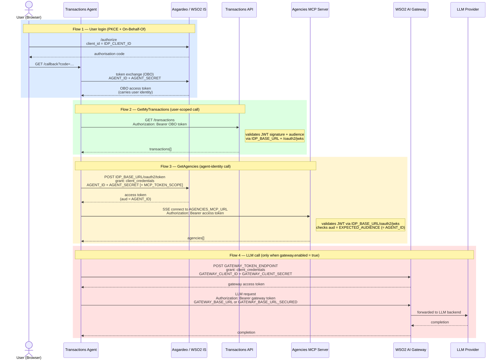

# Requirements

## Tech stack

| Component | Runtime / Tool | Min version |
|-----------|---------------|-------------|
| React frontend | Node.js + npm | Node 20+ |
| Node/Express server | Node.js + npm | Node 20+ |
| Transactions API | Python + pip | Python 3.11+ |
| Transactions Agent | Python + pip | Python 3.11+ |
| Container-based deployment option | Docker or Podman | — |

> All Node dependencies are installed via `npm install` inside `app/` and `server/`.
> All Python dependencies are installed via `pip install -r requirements.txt` inside each service directory (or automatically by the deploy scripts).

## Identity provider

- Asgardeo (https://console.asgardeo.io) or WSO2 Identity Server 7.2+


# Default Ports

| Port   | Service                                | Change it in                                                 |
| ------ | -------------------------------------- | ------------------------------------------------------------ |
| `5173` | React frontend (Vite dev/preview)      | `app/vite.config.js` → `server.port` / `preview.port`        |
| `3002` | Node/Express backend server            | `server/.env` → `PORT`                                       |
| `8010` | Transactions API (FastAPI)             | `transactions-api/app/main.py` → uvicorn `--port`, `server/.env` → `TRANSACTIONS_API_URL`, `transactions-api/Dockerfile` → `EXPOSE` + `CMD --port`, `docker-compose.yml` → port mapping |
| `8011` | Transactions Agent WebSocket (FastAPI) | `script/bank-of-asgard-agent.service` → `--port`, `transactions-agent/.env` → `IDP_REDIRECT_URI` callback path, `transactions-agent/Dockerfile` → `EXPOSE` + `CMD --port`, `docker-compose.yml` → port mapping |
| `8012` | Agencies MCP Server (FastMCP SSE)      | `agencies-mcp-server/server.py` → port constant, `docker-compose.yml` → port mapping |

When changing a port, also update:

- `transactions-api/.env` → `CORS_ORIGINS` (must include the frontend origin)
- `app/public/config.js` → `API_BASE_URL` / `API_SERVICE_URL` (if changing port 3002) or `TRANSACTIONS_AGENT_URL` (if changing port 8011)
- Any redirect URIs registered in the identity provider console

# Identity Provider Setup

The full setup requires:

1. The creation of 3 applications (Frontend/Backend/Agent)
2. The registration of the agent identity (credentials)
3. The creation of custom attributes and addition of these attributes to the OpenID connect profiles.

Following table summarizes the apps and credentials setup and where this information is configured in the various environment files. 

| #    | What                  | Kind                                              | Credentials used in                                          |
| ---- | --------------------- | ------------------------------------------------- | ------------------------------------------------------------ |
| 1    | **Frontend SPA**      | Application                                       | `APP_CLIENT_ID` in `app/public/config.js`                    |
| 2    | **Server TWA**        | Application                                       | `SERVER_APP_CLIENT_ID` / `SERVER_APP_CLIENT_SECRET` in `server/.env` |
| 3    | **Agent identity**    | Agent — an IS principal, similar to a user        | `AGENT_ID` / `AGENT_SECRET` in `transactions-agent/.env`     |
| 4    | **Agent application** | Application — public client, token exchange grant | `IDP_CLIENT_ID` in `transactions-agent/.env`                 |

## Custom Attributes

1. Create [custom attributes](https://wso2.com/asgardeo/docs/guides/users/attributes/manage-attributes/) named `accountType` and `businessName`. Add the businessName, accountType and country attributes to the profile scope (User Attributes and Store &rarr; User Attributes)
2. Create another [custom attribute](https://wso2.com/asgardeo/docs/guides/users/attributes/manage-attributes/) with the name `isFirstLogin`.
3. Enable the [Attribute Update Verification](https://wso2.com/asgardeo/docs/guides/users/attributes/user-attribute-change-verification/) for user email.

## FrontEnd Application

1. Create a SPA application.

  * Navigate to the "Shared Access" tab and share the application with all organizations.
  * Enable the `Code`, `Refresh Grant` and `Organization Switch` types. 
   > [!NOTE]	
   >
   > The organization switch grant type is available only after shared access is enabled.


1. Add authorized redirect URL: `http://localhost:5173` and allowed origin: `http://localhost:5173` (Adapt this to the port used by the app. 5173 is the default Vite port.)

2. Add the `mobile`, `country`, `email` and `accountType` to the **profile** scope ( `User Attributes & Stores` &rarr; `Attributes` &rarr; `OpenId Connect` &rarr; `Scopes` &rarr; `Profile` &rarr; `New Attribute`)

3. Enable the following scopes and attributes within the client application created.  
    * Profile: `Country, First Name, Last Name, Username, Birth Date, AccountType, Business Name, Email`
    * Email: `email`
    * Phone : `telephone`
    * Address:   `country`

4. Enable the following authenticators within the client application:

     * `Identifier First` - First Step
     * `Username and Password`, `Passkey` - Second Step
     * `TOTP` and `Email OTP` - Third Step
5. Configure the conditional authentication script (replace the `<NODE_SERVER_BASE_PATH>` with the backend server URL) with the one found at [conditional-auth-script.js](./prod_deployment/conditional-auth-script.js).

> [!IMPORTANT]	
>
> If you are using Asgardeo or an identity server deployment on a VM for example, you must expose the server (running on localhost, port 3002) so that the identity server can access it: the server exposes a /risk endpoint which is called when a user  logs in. You can do this with something like **[ngrok](https://ngrok.com)** for example and then use the ngrok URL as the value for NODE_SERVER_BASE_PATH. 

6. As part of the demo, you create, modify and delete users and roles. You therefore must enable API authorization access for the following API resources:

     - Organization APIs
       - Application Management API
         ```
         internal_org_application_mgt_update internal_org_application_mgt_delete internal_org_application_mgt_create internal_org_application_mgt_view
         ```
       - Identity Provider Management API
         ```
         internal_org_idp_view internal_org_idp_delete internal_org_idp_update internal_org_idp_create
         ```
       - SCIM2 Users API with the scopes:
         ```
         internal_org_user_mgt_update internal_org_user_mgt_delete internal_org_user_mgt_list internal_org_user_mgt_create 
         ```
       - SCIM2 Roles API with the scopes:
         ```
         internal_org_user_mgt_view internal_org_role_mgt_delete internal_org_role_mgt_create internal_org_role_mgt_update internal_org_role_mgt_view
         ```

## Server Application

1. Create a standard web application.
2. Navigate to the "Shared Access" tab and share the application with all organizations.
3. Enable the following grant types:
     `Code`, `Client Credentials`, `Organization Switch`

> [!NOTE]
>
> The organization switch grant type is available only after shared access is enabled.

4. Add the Authorized redirect URLs and allowed origins:
   redirect url: `https://localhost:3002`, allowed origin: `https://localhost:3002 http://localhost:5173`

5. Enable API Authorization access for the following API resources:

     - Management APIs
       - SCIM2 Users API with the scopes:
         ```
         internal_user_mgt_create internal_user_mgt_list internal_user_mgt_view internal_user_mgt_delete internal_user_mgt_update
         ```
       - Organization Management API with the scopes:
         ```
         internal_organization_create internal_organization_view internal_organization_update internal_organization_delete
         ```

     - Organization APIs
       - SCIM2 Users API with the scopes:
         ```
         internal_org_user_mgt_update internal_org_user_mgt_delete internal_org_user_mgt_list internal_org_user_mgt_create 
         ```
       - SCIM2 Roles API with the scopes:
         ```
         internal_org_user_mgt_view internal_org_role_mgt_delete internal_org_role_mgt_create internal_org_role_mgt_update internal_org_role_mgt_view
         ```


## Additional Setup

1. Navigate to the User Management &rarr; Roles tab and create an organization role named `Business Administrator` with the permissions for the SCIM2 Users and SCIM2 Roles organization APIs. Also, create organization roles `Manager`, `Auditor` and `Member`.

2. Navigate to Connections &rarr; Passkey Setup &rarr; Add the Trusted Origins: `http://localhost:5173` and enable `Allow Passkey usernameless authentication` option.

3. [Optional] Configure [Onfido identity verification](https://wso2.com/asgardeo/docs/guides/identity-verification/add-identity-verification-with-onfido/) for your organization - If you do not have access to Onfido, you won't be able to use the profile verification feature of the application.

## Transactions Agent


1. Navigate to `App_home/app` and run `npm i`.

2. From within the `App_home/app` directory, execute `npm start` to run the application.

3. Create a copy of `server/.env.example` inside the `server/` folder. And name it as `.env`. Update the according to the commented instructions.

4. Navigate to `App_home/server` and run `npm i`.

5. From within the `App_home/server` directory, execute `nodemon server.js` to run the server.

---

## Transactions AI Agent — Token Flows

The agent uses **three independent sets of credentials**, each with a different purpose and lifetime. The diagram below shows which environment variable is used at each step.



**Credential summary**

| Env var pair | Issued by | Used for | Validates in |
|---|---|---|---|
| `IDP_CLIENT_ID` | Asgardeo (public app) | PKCE login — identifies the app to the IDP | IDP login page |
| `AGENT_ID` + `AGENT_SECRET` | Asgardeo (agent principal) | OBO token exchange (Flow 1) **and** MCP bearer token (Flow 3) | Transactions API + Agencies MCP Server |
| `GATEWAY_CLIENT_ID` + `GATEWAY_CLIENT_SECRET` | WSO2 AI Gateway | LLM API access via gateway (Flow 4 only) | WSO2 AI Gateway |

> `EXPECTED_AUDIENCE` in `agencies-mcp-server/.env` must equal `AGENT_ID` — Asgardeo puts the requesting client's ID in the `aud` claim of client-credentials tokens.

---

## Transactions AI Agent — Setup

The project includes an AI-powered transaction assistant. Three framework implementations are available — see **[docs/transactions-agent-setup.md](docs/transactions-agent-setup.md)** for the full architecture, security pattern, and end-to-end test checklist. The summary below covers the required configuration steps.

### Asgardeo / WSO2 IS Configuration

Before running the agent services, complete the following in your identity provider console:

1. **Register the Transactions API resource** (Console → API Resources):

   - Name: `Transactions API`

   - Scopes: `read_transactions`, `admin_provision`

2. **Register the Agent identity** (Console → Agents → New Agent):

   - The agent gets its own IS principal (like a user account, not an application registration)
   - Name: `Transactions Agent`
   - Copy the generated **Agent ID** and **Agent Secret** — shown only once. These become `AGENT_ID` and `AGENT_SECRET`.

3. **Register the Agent application** (Console → Applications → New Application → public client):
   - Enable the **Token Exchange** grant type — this allows the agent to perform the OBO exchange on behalf of users
   - Add the redirect URI: `http://localhost:8011/callback`
   - Add the allowed origin: `http://localhost:8011`
   - Copy the generated **Client ID** — this becomes `IDP_CLIENT_ID` in `transactions-agent/.env`
   
4. Authorise the **server application** for provisioning (Console → Applications → server app → API Authorisation):

   - Add `Transactions API` with scope `admin_provision`
   - Ensure those scopes are present: `internal_role_mgt_view`, `internal_role_mgt_users_update`

5. Configure the existing **frontend SPA application** (`APP_CLIENT_ID` in `config.js`):

   - **Add `read_transactions` scope** so users can grant the agent access via the consent flow

---

# Application Setup

## Frontend & Backend

1. Create a copy of `app/public/config.example.js` inside the `app/public/` folder and name it `config.js`. Update the [config values](docs/config-properties.md) accordingly.

   **Optional — AWS branding:** to show "Powered by AWS" logos on the home page and transactions page, uncomment the flag in `config.js`:
   ```js
   AWS_BRANDING: true,
   ```
   No rebuild is needed — `config.js` is a static file read at runtime.

2. Navigate to `App_home/app` and run `npm i`.

3. From within the `App_home/app` directory, execute `npm start` to run the application.

4. Create a copy of `server/.env.example` inside the `server/` folder and name it `.env`. Update according to the commented instructions.

5. Navigate to `App_home/server` and run `npm i`.

6. From within the `App_home/server` directory, execute `nodemon server.js` to run the server.

---

## Transactions Agent

> See **[docs/transactions-agent-setup.md](docs/transactions-agent-setup.md)** for the full architecture, OBO security pattern, LLM provider details, provisioning guide, and end-to-end test checklist.

### Agencies MCP Server

Create a copy of `agencies-mcp-server/.env.example` inside `agencies-mcp-server/` and name it `.env`. Fill in:

```env
IDP_BASE_URL=https://api.asgardeo.io/t/<ORG_NAME>   # or your WSO2 IS base URL
EXPECTED_AUDIENCE=<AGENT_ID>                        # client ID whose tokens this server accepts (= AGENT_ID)
# SSL_VERIFY=false   # only for self-signed certs in local dev
```

The server validates every inbound bearer token against the IDP's JWKS endpoint (`{IDP_BASE_URL}/oauth2/jwks`), including signature, expiry, and audience (`EXPECTED_AUDIENCE`). The agent obtains this token using its own client credentials (`AGENT_ID`/`AGENT_SECRET`) — set `EXPECTED_AUDIENCE` to the same value as `AGENT_ID`. When deployed via Docker Compose it starts automatically with any agent profile — no separate startup step is needed.

### Transactions API

Create a copy of `transactions-api/.env.example` inside `transactions-api/` and name it `.env`. Fill in:

```env
JWKS_URL=https://api.asgardeo.io/t/<ORG_NAME>/oauth2/jwks or https://my.local_is.com/oauth2/jwks
JWT_ISSUER=https://api.asgardeo.io/t/<ORG_NAME>/oauth2/token or https://my.local_is.com/oauth2/token
JWKS_CACHE_TTL=3600

# CORS — comma-separated list of allowed origins
CORS_ORIGINS=http://localhost:5173,http://localhost:3002
```

### LLM Configuration

Edit `llm_config.yaml` at the repo root to select the LLM provider:
```yaml
# provider: openai | gemini | anthropic | bedrock | mistral
provider: openai
# model: gpt-4o-mini   # uncomment to override the default
```

| Provider    | Default model                                    | Notes                        |
|-------------|--------------------------------------------------|------------------------------|
| `openai`    | `gpt-4o-mini`                                    |                              |
| `gemini`    | `gemini-2.5-flash-lite`                          |                              |
| `anthropic` | `claude-sonnet-4-5-20250929`                     |                              |
| `bedrock`   | `eu.anthropic.claude-sonnet-4-6-20250514-v1:0`  | strands agent only           |
| `mistral`   | `mistral-small-latest`                           | OpenAI-compatible API        |

**Optional — WSO2 API Gateway:** to route LLM calls via a gateway instead of a direct API key:
```yaml
# llm_config.yaml
gateway:
  enabled: true
```
```env
# transactions-agent/.env
GATEWAY_BASE_URL=<GATEWAY_BASE_URL>
GATEWAY_BASE_URL_SECURED=<GATEWAY_BASE_URL_SECURED>   # guardrail-enabled endpoint (optional)
GATEWAY_TOKEN_ENDPOINT=<GATEWAY_TOKEN_ENDPOINT>
GATEWAY_CLIENT_ID=<GATEWAY_CLIENT_ID>
GATEWAY_CLIENT_SECRET=<GATEWAY_CLIENT_SECRET>
```
See [docs/transactions-agent-setup.md](docs/transactions-agent-setup.md) for gateway token refresh behaviour and fallback options.

**Agencies MCP API registration (WSO2 AI Gateway):** after `agencies-mcp-server` is running, register it as an MCP API in the gateway console:

- **Backend URL**: `http://host.containers.internal:8012/sse`
- Enable **OAuth2 protection** so the agent must present a bearer token
- Enable **Send Access Token To Backend** (policy) so the validated token is forwarded to `agencies-mcp-server` for its own JWT check
- Set the resulting gateway-managed SSE URL as `MCP_GATEWAY_URL` in `transactions-agent/.env` and set `MCP_GATEWAY_ENABLED=true`
- If the gateway requires a specific scope, set it as `MCP_TOKEN_SCOPE`

When `MCP_GATEWAY_ENABLED` is unset or `false`, the agent connects directly to `AGENCIES_MCP_URL` (useful for local dev without the gateway).

`GATEWAY_BASE_URL_SECURED` points to the guardrail-protected variant of the gateway endpoint (e.g. with prompt injection / content policies enforced). When set, the frontend can activate it by connecting to the agent WebSocket with `?secured=true`. If unset, the agent falls back to `GATEWAY_BASE_URL` for both modes.

### Transactions Agent

1. Create a copy of `transactions-agent/.env.example` inside `transactions-agent/` and name it `.env`. Fill in:

```env
IDP_CLIENT_ID=<SPA_APP_CLIENT_ID>
IDP_BASE_URL=https://api.asgardeo.io/t/<ORG_NAME>
IDP_REDIRECT_URI=http://localhost:8011/callback

AGENT_ID=<AGENT_ID>
AGENT_SECRET=<AGENT_SECRET>

TRANSACTIONS_API_BASE_URL=http://transactions-api:8010   # use container name when running via Docker/Podman

# Set the key matching the provider in llm_config.yaml (not needed when gateway is enabled)
OPENAI_API_KEY=<OPENAI_API_KEY>
# GEMINI_API_KEY=<GEMINI_API_KEY>
# ANTHROPIC_API_KEY=<ANTHROPIC_API_KEY>
# MISTRAL_API_KEY=<MISTRAL_API_KEY>

# WSO2 API Gateway (only when gateway.enabled: true in llm_config.yaml)
# GATEWAY_BASE_URL=<GATEWAY_BASE_URL>
# GATEWAY_TOKEN_ENDPOINT=<GATEWAY_TOKEN_ENDPOINT>
# GATEWAY_CLIENT_ID=<GATEWAY_CLIENT_ID>
# GATEWAY_CLIENT_SECRET=<GATEWAY_CLIENT_SECRET>

# Agencies MCP Server — the agent authenticates using AGENT_ID/AGENT_SECRET (above)
# Direct endpoint (default, no gateway routing):
AGENCIES_MCP_URL=http://agencies-mcp-server:8012/sse
# Gateway-routed endpoint (optional):
# MCP_GATEWAY_URL=https://<GATEWAY_HOST>/agencies/sse
# MCP_GATEWAY_ENABLED=true
# MCP_TOKEN_SCOPE=             # optional: OAuth scope to request when obtaining the MCP bearer token

# Disable TLS certificate verification — use only for localhost dev with self-signed certs
# SSL_VERIFY=false
```

2. Add the agent WebSocket URL to `app/public/config.js`:

```js
TRANSACTIONS_AGENT_URL: "ws://localhost:8011"
```

### Running with Docker / Podman (recommended)

The compose file uses **profiles** to select which agent implementation to run (`autogen`, `strands`, or `langchain`). Only one agent listens on port 8011 at a time. The `agencies-mcp-server` (port 8012) has no profile and starts automatically alongside whichever agent profile is active.


1. (Podman only) The Dockerfile mounts the llm_config file - For Podman, it needs to be in a folder that the podman machine has access to by default (your home directory) - If you use podman, copy `llm_config.yaml` to `~/podman_share/llm_config.yaml`:

```bash
mkdir -p ~/podman_share
cp llm_config.yaml ~/podman_share/llm_config.yaml
```

2. Start the agent and the api, specifying the agent profile:

```bash
# Choose one: autogen | strands | langchain
podman compose --profile langchain up --build -d
```

To enable **WSO2 Agent Manager (AMP) instrumentation** (supported by `langchain` and `strands` only), pass the overlay file and set `AMP_AGENT_API_KEY` in `.env`:

```bash
podman compose -f docker-compose.yml -f docker-compose.amp.yml --profile langchain up --build -d
```

3. View logs

```bash
podman compose logs -f transactions-api
podman compose logs -f bank-transactions-agent
```

4. Stop

```bash
podman compose down
```

### Demo scripts (quickstart)

The `demo_scripts/` directory provides three helper scripts for local development.

> **Platform support:** macOS and Linux. Windows requires [WSL](https://learn.microsoft.com/en-us/windows/wsl/install) (Windows Subsystem for Linux).


| Script | Purpose |
|--------|---------|
| `demo_scripts/validate.sh` | Pre-flight check — verifies versions, config files, venvs, imports, and port availability |
| `demo_scripts/start-demo.sh [langchain\|autogen\|strands]` | Starts the full stack in order, polls each health endpoint before moving on |
| `demo_scripts/stop-demo.sh` | Gracefully stops everything started by `start-demo.sh` |

```bash
# Check everything is configured correctly
./demo_scripts/validate.sh

# Start the full stack (prompts for agent if not specified)
./demo_scripts/start-demo.sh langchain

# Stop when done
./demo_scripts/stop-demo.sh
```

Logs are written to `.demo-logs/` and process IDs are tracked in `.demo.pids`.

---

### Running Natively (development)

Each agent implementation has its own virtual environment inside its subdirectory.

1. From within the `transactions-api/` directory:

```bash
python3.11 -m venv venv && source venv/bin/activate
pip install -r requirements.txt
uvicorn app.main:app --reload --port 8010
```

2. From within the `transactions-agent/` directory — create a venv per agent (one-time), then run:

```bash
# One-time setup (repeat for each agent you want to use)
python3.11 -m venv langchain-agent/venv && langchain-agent/venv/bin/pip install -r langchain-agent/requirements.txt
python3.11 -m venv autogen-agent/venv   && autogen-agent/venv/bin/pip install   -r autogen-agent/requirements.txt
python3.11 -m venv strands-agent/venv   && strands-agent/venv/bin/pip install   -r strands-agent/requirements.txt

# Activate the venv for the chosen agent, then start it
source langchain-agent/venv/bin/activate
PYTHONPATH=$(pwd) uvicorn service:app --app-dir langchain-agent --reload --port 8011
# For autogen:  source autogen-agent/venv/bin/activate  && PYTHONPATH=$(pwd) uvicorn service:app --app-dir autogen-agent  --reload --port 8011
# For strands:  source strands-agent/venv/bin/activate  && PYTHONPATH=$(pwd) uvicorn service:app --app-dir strands-agent  --reload --port 8011
```
