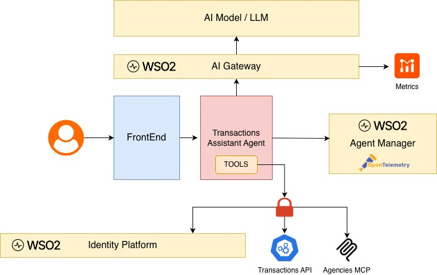

# Foreword

This demo is an extension/rework of the original Bank of Asgard demo which was built to demonstrate IS CIAM capabilities. The instructions configure the demo only for the purpose of showing WSO2 Agentic platform capabilities. Identity server setup, in particular, is quite different. If you are looking to demo  CIAM/B2B capabilities, get the [original version](https://github.com/asgardeo-samples/bank-of-asgard). 

Using this demo, you can experience:

- AI Guardrails, including gateway-enforced redaction of sensitive profile fields (e.g. date of birth) before they reach the LLM
- Agentic identity and OBO flows 
- Agent Management

# Deployment Architecture

The Asgard assistant is a coordinator agent which can help Asgard customers with transactions information, as well as viewing and updating their basic profile details (name, country, mobile number) via `GetMyProfile`/`UpdateMyProfile`. In its langchain version, it can also give investment recommendations, leveraging sub-agents and the separate savings agent. 

All LLM calls are proxied through the WSO2 AI Gateway. Users management and agent identity are provided by WSO2's Identity platform. Finally, agent observability and governance is provided by Agent Manager.



# Requirements

## WSO2 Products

The following products are used in the context of this demo

- WSO2 Identity Platform (on-prem or SaaS) for Agentic Identity, MCP identity and access control.
- WSO2 AI Gateway (4.6 or 4.7 versions) for LLM governance and AI guardrails
- WSO2 Agent Manager for agent observability, governance and hosting
- WSO2 Moesif for AI and API Analytics

## Tech stack

| Component | Runtime / Tool | Min version |
|-----------|---------------|-------------|
| React frontend | Node.js + npm | Node 20+ |
| Node/Express server | Node.js + npm | Node 20+ |
| Transactions API | Python + pip | Python 3.13+ |
| Transactions Agent (plus subagents, Langchain only) | Python + pip | Python 3.13+ |
| Agencies MCP Server | Python + pip | Python 3.13+ |
| Savings Goals Agent (Langchain only) | Python + pip | Python 3.13+ |
| Tax Agent  (Langchain only, optional) | Python + pip | Python 3.13+ |
| Container-based deployment *(optional)* | Docker or Podman | — |

> All Node dependencies are installed via `npm install` inside `app/` and `server/`.
> All Python dependencies are installed via `pip install -r requirements.txt` inside each service directory

## Identity provider

The following instructions have been last tested in July 2026 on the SaaS Identity Platform (https://console.asgardeo.io) and WSO2 Identity Server **7.2** (VM).

# Identity Provider Setup

The full setup requires:

1. The creation of 5 applications (Frontend / Backend / Transactions Agent / Agencies MCP Client / Savings Agent), plus an optional 6th for the Tax Agent
2. The registration of the Transaction agent identity (credentials)
3. The creation of custom attributes and addition of these attributes to the OpenID connect profiles.

Following table summarizes the apps plus credentials setup, and where this information is configured in the various environment files.

| #    | What                       | Kind                                              | Default AppName | ClientIDs /Client Secrets / Credentials used in              |
| ---- | -------------------------- | ------------------------------------------------- | --------------- | ------------------------------------------------------------ |
| 1    | **Frontend SPA**           | Single Page Application                      | BOA-Frontend    | `APP_CLIENT_ID` in `app/public/config.js`                    |
| 2    | **Server SWA**             | Server Web Application                            | BOA-Backend     | `SERVER_APP_CLIENT_ID` / `SERVER_APP_CLIENT_SECRET` in `server/.env` |
| 4    | **Asgard Assistant application** | Traditional Web Application — public client, token exchange grant | BOA-Agent       | `AGENT_APP_ID` in `transactions-agent/.env`                  |
| 5    | **MCP Client application** | MCP client app                      | BOA-Agencies    | `MCP_CLIENT_ID` in `transactions-agent/.env`; `EXPECTED_AUDIENCE` in `agencies-mcp-server/.env` |
| 6    | **Savings Agent ** | Traditional Web Application — Public client, client credentials grant | BOA-Savings     | `SAVINGS_AGENT_CLIENT_ID` in `transactions-agent/.env`; <br />`EXPECTED_AUDIENCE` in `savings-goals-agent/.env` |
| 7    | **Tax Agent** *(optional)* | Traditional Web Application — Public client, client credentials grant | BOA-Tax | `TAX_AGENT_CLIENT_ID` in `transactions-agent/.env`; <br />`EXPECTED_AUDIENCE` in `tax-agent/.env` |

## Custom User Attributes

1. Create [custom attributes](https://wso2.com/asgardeo/docs/guides/users/attributes/manage-attributes/) named `accountType` ,  `businessName`, `isFirstLogin`

   | Attribute Name / Display Name | Type    | Values              | Input Format | Display                    |
   | ----------------------------- | ------- | ------------------- | ------------ | -------------------------- |
   | accountType                   | OPTIONS | Business / Personal | DropDown     | Admin Console/User Profile |
   | isFirstLogin                  | BOOLEAN | N/A                 | CheckBox     | Admin Console              |
   | businessName                  | TEXT    |                     | Text input   | Admin Console/User Profile |

2. Add those attributes to the Profile OIDC scope (from User Attributes and Store &rarr; User Attributes&rarr;OpenIDConnect &rarr;scopes)

3. Enable the [Attribute Update Verification](https://wso2.com/asgardeo/docs/guides/users/attributes/user-attribute-change-verification/) for user email.

## Agent Identity

The Asgard assistant agent gets its own IS principal (like a user account)

- Name: `Transactions Agent`
- Copy the generated **Agent ID** and **Agent Secret** (the secret is shown only once). These become `TRANSACTIONS_AGENT_ID` and `TRANSACTIONS_AGENT_SECRET`.

## Resources

Resources include APIs and MCPs.

1. **Register the Transactions API resource** (Console → Resources → API Resources)

   - Identifier: `http://boa-transaction-api` 
   - Name: `Transactions API`

   - Scopes: `read_transactions`, `admin_provision`
   - Select "Requires Authorization"

2. **Register the Agencies MCP Server ** (Console → Resources → MCP Servers)

   - Identifier: `http://boa-agencies-mcp` 	
   - Name: `Agencies MCP Server`
   - No scopes are required

## Roles

We need to create a role, which is assigned automatically to new personal banking users. The role is called **Read_Transactions** and has access to the read_transactions scope on the Transactions API - This name is the default one used in the code, but can be overriden in the .env file of the backend application if necessary.

- Create the role as an <u>organization</u> role

- On Permissions, select the Transactions API and select the read_transactions scope.

## Additional IS Configuration

Navigate to Connections &rarr; Passkey &rarr; Set Up &rarr; Add the Trusted Origins: `http://localhost:5173` and enable `Allow Passkey usernameless authentication` option.

# Applications

## FrontEnd

1. Create a Single Page Application (SPA), call it **BOA-FrontEnd**

2. Set the redirect URL to`http://localhost:5173` (adapt this to the port used by the app. 5173 is the default Vite port)

3. Select "Allow Sharing with organizations" and "Allow AI agents to use this application"
     * Confirm to share will all organizations (this is used when creating business accounts, which behind the scenes created sub-orgs per business)

4. On the protocol tab, ensure the `Code`, `Refresh Grant` and `Organization Switch` grant types are selected

5. On the User Attributes tab, enable the following scopes and attributes.  

   1. Profile: `Country, First Name, Last Name, Username, Birth Date, AccountType, Business Name, Email`

   * Email: `email`

   * Phone : `telephone`

   * Address:   `country`

6. On the Login Flow tab, enable the following authenticators:

   * `Identifier First` - First Step

   * `Username and Password`, `Passkey` - Second Step

Note the **Client ID**, you will use it to set `APP_CLIENT_ID` in `app/public/config.js`

## Backend

1. Create a standard web application, call it **BOA-Backend**.
     * Select OAuth2 as the protocol
     * Select "Allow Sharing with organizations" and "Allow AI agents to use this application"

2. On the protocol tab, select the `Code`, `Client Credentials` and `Organization Switch` grant types

3. Set the redirect URL to`https://localhost:3002` (adapt this to the port if you changed it)

4. Add the following allowed origins:`https://localhost:3002` and `http://localhost:5173`

5. Enable API Authorization access for the following API resources:

     - Transaction API with scopes: `read_transactions`and  `admin_provision`

6. As part of the demo, you create, modify and delete users and roles. You therefore must enable API authorization access for the following API resources:

     1. **Management APIs**

        - SCIM2 Users API with the scopes
      		
          ```
          internal_user_mgt_create internal_user_mgt_delete internal_user_mgt_list internal_user_mgt_update internal_user_mgt_view
          ```
        
		- SCIM2 Roles API with the scopes:
        ```
        internal_role_mgt_users_update internal_role_mgt_view 
        ```

     > [!NOTE]
     >
     > In the latest versions of IS / Asgardeo, some scopes will be added automatically as you add those above.

     Note the clientID and clientSecret - You will use them to set `SERVER_APP_CLIENT_ID` / `SERVER_APP_CLIENT_SECRET` in `server/.env`.

## Assistant Agent

1. Create a traditional web application, call it **BOA-Agent**.
2. Once the app is created, enable the **Code** and  **Token Exchange** grant types ( this allows the agent to perform the OBO exchange on behalf of users)
3. Select the Public Client option (secret will be removed)
4. Add the redirect URL: `http://localhost:8013/callback` and `http://localhost:8011/callback`
5. Add the allowed origins: `http://localhost:8013` and `http://localhost:8011`
6. Ensure token format is JWT.
7. Under **Advanced**, enable "App Native Authentication "
8. Copy the generated **Client ID** — You will use it to set `AGENT_APP_ID` in `transactions-agent/.env`

## Savings Agent (LangChain only)

1. Create a traditional web application, call it **Savings-Agent**.
2. Once the app is created, enable the **Code** and  **Token Exchange** grant types
3. Select the Public Client option (secret will be removed)
4. Add the redirect URL: `http://localhost:8011/callback`
5. Add the allowed origin: `http://localhost:8011`
6. Ensure token format is JWT.
7. Under **Authorization**, add the Transactions API and the `read_transactions` scope (this is required, otherwise the scope won't be added to the OBO token)
8. Under **Roles**, make sure Audience is set to Organization (since we are creating organization-level roles)
9. Under **Advanced**, enable "App Native Authentication"
10. Copy the generated **Client ID** — You will use to set `SAVINGS_AGENT_CLIENT_ID` in `transactions-agent/.env` and `EXPECTED_AUDIENCE` in `savings-goals-agent/.env`

## Tax Agent — Ministry of Finance (LangChain only, optional)

Skip this section to run the demo without the tax flow; both tax tools then stay unregistered.

1. Create a traditional web application, call it **BOA-Tax**.
2. Once the app is created, enable the **Code** and **Token Exchange** grant types
3. Select the Public Client option (secret will be removed)
4. Add the redirect URL: `http://localhost:8011/callback`
5. Add the allowed origin: `http://localhost:8011`
6. Ensure token format is JWT.
7. Under **Advanced**, enable "App Native Authentication"
8. Copy the generated **Client ID** — You will use it to set `TAX_AGENT_CLIENT_ID` in `transactions-agent/.env` and `EXPECTED_AUDIENCE` in `tax-agent/.env`

### Optional: a dedicated consent scope

For the citizen to see a consent screen that names the purpose ("share your tax figures") rather than reusing the transaction-reading consent, register a `share_tax_data` scope and set `TAX_CONSENT_SCOPE=share_tax_data` in `transactions-agent/.env`:

It is an **API resource** scope, not an MCP one — MCP servers are registered separately (the Agencies MCP server has no scopes at all), and OBO consent scopes come from API resources.

Add it to the **existing Transactions API resource** rather than creating a new one:

1. On the Transactions API resource (Console → Resources → API Resources, identifier `http://boa-transaction-api`), add the scope `share_tax_data`.
2. On the **BOA-Agent** app, under **Authorization**, add that scope alongside `read_transactions`.
3. Add it to the **Read_Transactions** role's permissions, so the signed-in user actually holds the right.

The reason it belongs on that same resource: `SummarizeDeductibleExpenses` reads the user's transactions with this token, and `/transactions` enforces `read_transactions` whatever the consent was named. The tool therefore requests **both** scopes (`TAX_SCOPES` in `transactions-agent/app/tools.py`), and one OBO token can only carry them cleanly under one audience if both scopes live on the same API resource. Splitting `share_tax_data` onto a separate resource would mean a token spanning two audiences — avoid it unless you have time to work through how your IDP version handles that.

The distinct consent prompt still appears, because the token cache is keyed on the scope set: `[read_transactions, share_tax_data]` is a different key from `[read_transactions]`, so it mints its own token and triggers its own authorisation.

> [!CAUTION]
>
> The role's audience must match the app's audience level (Organization vs Application), or the scope is silently dropped from the OBO token and the tool fails with a missing-scope error. This is the same audience-matching requirement as elsewhere in this setup.

Leaving `TAX_CONSENT_SCOPE` unset falls back to `read_transactions`: the flow works end to end, but without its own consent prompt.


## MCP Client

1. Create  an MCP Client application (Console → Applications → MCP Client)
   * Call it **BOA-MCP**
   * Use the redirect URL: `http://localhost:8011/callback`
   * Check *Public Client*

2. Once the app is created, add the allowed origin: `http://localhost:8011`
3. Under **API Authorisation**, add the `Agencies MCP Server` resource registered above
4. Under **Advanced**, enable "App Native Authentication "
5. Copy the generated **Client ID** — You will use it to set:
   1. `MCP_CLIENT_ID` in `transactions-agent/.env`
   2. `EXPECTED_AUDIENCE` in `agencies-mcp-server/.env` 


# Application Setup

## Default Ports

| Port   | Service                              | Change it in                                                 |
| ------ | ------------------------------------ | ------------------------------------------------------------ |
| `5173` | React frontend (Vite dev/preview)    | `app/vite.config.js` → `server.port` / `preview.port`        |
| `3002` | Node/Express backend server          | `server/.env` → `PORT`                                       |
| `8010` | Transactions API (FastAPI)           | `transactions-api/app/main.py` → uvicorn `--port`, `server/.env` → `TRANSACTIONS_API_URL`, `transactions-api/Dockerfile` → `EXPOSE` + `CMD --port`, `docker-compose.yml` → port mapping |
| `8011` | Asgard Assistant WebSocket (FastAPI) | `script/bank-of-asgard-agent.service` → `--port`, `transactions-agent/.env` → `IDP_REDIRECT_URI` callback path, `transactions-agent/Dockerfile` → `EXPOSE` + `CMD --port`, `docker-compose.yml` → port mapping |
| `8012` | Agencies MCP Server (FastMCP SSE)    | `agencies-mcp-server/server.py` → port constant, `docker-compose.yml` → port mapping |
| `8013` | Savings Goals Agent (FastAPI)        | `savings-goals-agent/server.py` → port constant              |
| `8014` | Tax Agent — Ministry of Finance (FastAPI) | `tax-agent/server.py` → port constant, `transactions-agent/.env` → `TAX_AGENT_URL` |

When changing a port, also update:

- `transactions-api/.env` → `CORS_ORIGINS` (must include the frontend origin)
- `app/public/config.js` → `API_BASE_URL` / `API_SERVICE_URL` (if changing port 3002) or `TRANSACTIONS_AGENT_URL` (if changing port 8011)
- Any redirect URIs registered in the WSO2 Identity Platform console
- The port constants at the top of `demo_scripts/validate.sh`, `demo_scripts/start-demo.sh`, `demo_scripts/stop-demo.sh`, and `demo_scripts/restart.sh` — each file has a clearly marked `PORT_*` block for exactly this purpose

## **Credentials**

| Env var pair                                          | Issued by                       | Used for                                                     | Validates in        | SAMPLE VALUE                        |
| ----------------------------------------------------- | ------------------------------- | ------------------------------------------------------------ | ------------------- | ----------------------------------- |
| `AGENT_APP_ID`                                        | Asgardeo / IS (public app)      | PKCE login — identifies the app to the IDP                   | IDP login page      | AGENT_123                           |
| `TRANSACTIONS_AGENT_ID` + `TRANSACTIONS_AGENT_SECRET` | Asgardeo / IS (agent principal) | OBO token exchange (Flow 1) — credentials in native auth step | Transactions API    | AGENTID_123 / AGENTSECRET_123       |
| `MCP_CLIENT_ID`                                       | Asgardeo / IS (public app)      | MCP bearer token (Flow 3)                                    | Agencies MCP Server | MCP_123                             |
| `SAVINGS_AGENT_CLIENT_ID`                             | Asgardeo / IS (public app)      | Savings Goals agent bearer token (client-credentials)        | Savings Goals Agent | SAVINGS_123                         |
| `TAX_AGENT_CLIENT_ID`                                 | Asgardeo / IS (public app)      | Tax agent bearer token (client-credentials)                  | Tax Agent           | TAX_123                             |
| `GATEWAY_CLIENT_ID` + `GATEWAY_CLIENT_SECRET`         | WSO2 AI Gateway                 | LLM API access via gateway (Flow 4 only)                     | WSO2 AI Gateway     | GW_CLIENTID / GWCLIENT_SECRET       |
| `APP_CLIENT_ID`                                       | Asgardeo / IS                   | Credential for FrontEnd App                                  | IS                  | APP_123                             |
| `SERVER APP ID` + `SECRET`                            | Asgardeo / IS                   | Credentials for Backend App                                  | IS                  | SERVERID_123 SERVERSEC_123          |

> `EXPECTED_AUDIENCE` in `agencies-mcp-server/.env` must equal `MCP_CLIENT_ID` — Asgardeo / IS puts the requesting application's client ID in the `aud` claim.
> `EXPECTED_AUDIENCE` in `savings-goals-agent/.env` must equal `SAVINGS_AGENT_CLIENT_ID` for the same reason.
> `EXPECTED_AUDIENCE` in `tax-agent/.env` must equal `TAX_AGENT_CLIENT_ID`, likewise.

## Frontend

### Assistant panel width

The Asgard Assistant column is resizable — drag the handle on its right edge, double-click that handle to reset, or focus it and use the arrow keys (`Home` resets). It starts at 560px and clamps between 320px and 1000px.

The chosen width is remembered per browser via `localStorage`, so it survives reloads and navigation mid-demo. It is not shared between machines or browsers, and a browser blocking site data simply falls back to the default. The handle is hidden below the `md` breakpoint, where the columns stack. This applies everywhere the assistant appears: the transactions, personal banking and business profile pages, and the business member view.

1. Create a copy of `app/public/config.example.js` inside the `app/public/` folder and name it `config.js`. 

   

   ```js
   window.config = {
   
     API_BASE_URL: "http://localhost:3002",  
     API_SERVICE_URL: "http://localhost:3002",
     APP_BASE_URL: "http://localhost:5173",
     IDP_BASE_URL: "https://myidentity-server.com:9445",
     ORGANIZATION_NAME: "carbon.super",
     // Asgardeo Setup
     // IDP_BASE_URL: "https://api.asgardeo.io/t/myOrg",
     // ORGANIZATION_NAME: "myOrg",
     APP_CLIENT_ID: "APP_123",
     APP_NAME: "",
     DISABLED_FEATURES: [],
     TRANSFER_THRESHOLD: 10000,
     IDENTITY_VERIFICATION_PROVIDER_ID: "",
   
     IDENTITY_VERIFICATION_CLAIMS: [
     	"http://wso2.org/claims/dob",
     ],
   
     TRANSACTIONS_AGENT_URL: "ws://localhost:8011", // Adjust if you change the ports
     AWS_BRANDING: false,  // uncomment to show "Powered by AWS" logos
   
   	DEMO_USERS: {
       personal: {
         firstName: "Thor",
         lastName: "Odinson",
         username: "thor.odinson",
         email: "thor@asgard.demo",
         password: "Demo@12345",
         dateOfBirth: "1985-03-15",
         country: "Norway",
         mobile: "0411111111"
       },
       business: {
         firstName: "Loki",
         lastName: "Laufeyson",
         username: "loki.laufeyson",
         email: "loki@asgard.demo",
         password: "Demo@12345",
         dateOfBirth: "1987-06-01",
         country: "Norway",
         mobile: "0422222222",
         businessName: "Asgard Enterprises"
       }
     }
   }
   ```

   No rebuild is needed — `config.js` is a static file read at runtime.

## Backend

Create a copy of `server/.env.example` inside the `server/` folder and name it `.env`. 

```yaml
# The port number that the server will listen to.
# Change this to the desired port number that the server should listen to.
# Change from 5000 which is used by Control Center on MacOS
PORT=3002

# The client ID for the Asgardeo Traditional Web Application (TWA) app
SERVER_APP_CLIENT_ID="SERVERID_123"

# The client ID for the Asgardeo Traditional Web Application (TWA) app
SERVER_APP_CLIENT_SECRET="SERVERSEC_123"

# The base URL for the identity provider's API
# For Asgardeo, use https://api.asgardeo.io/t/your-org
IDP_BASE_URL="https://myidentity-server.com:9445"

# The base URL for the client application
# E.g., http://localhost:5173
VITE_REACT_APP_CLIENT_BASE_URL="http://localhost:5173"

# GEO API Key - Only used for conditional login. Ignore.
GEO_API_KEY="dummy"

# Name of the user store to create the users. Default is "PRIMARY". 
# For Asgardeo, use "DEFAULT".
USER_STORE_NAME="PRIMARY"

# Name of the IS role assigned to new users on signup to grant access to transactions.
# Default is "Read_Transactions". Override if your role has a different name.
# TRANSACTIONS_ROLE_NAME="Read_Transactions"
```


### Agencies MCP Server

Create `.env` from `.env.example`:

```YAML
IDP_BASE_URL=https://api.asgardeo.io/t/<ORG_NAME>   # or your WSO2 IS base URL
EXPECTED_AUDIENCE=MCP_123                   				# client ID of the MCP Client Application (IS step 5)
# SSL_VERIFY=false   																# only for self-signed certs in local dev
```

> > [!CAUTION]
> >
> > `EXPECTED_AUDIENCE` must equal `MCP_CLIENT_ID` — the token issued via `MCP_CLIENT_ID`'s native auth flow carries `aud = MCP_CLIENT_ID`.

### Transactions API

Create a copy of `transactions-api/.env.example` inside `transactions-api/` and name it `.env`. 

```YAML
# Asgardeo JWT Validation
#JWKS_URL=https://api.asgardeo.io/t/<ORG_NAME>/oauth2/jwks
#JWT_ISSUER=https://api.asgardeo.io/t/<ORG_NAME>/oauth2/token
# IS JWT Validation
JWKS_URL=https://myidentity-server.com:9445/oauth2/jwks
JWT_ISSUER=https://myidentity-server.com:9445/oauth2/token
JWKS_CACHE_TTL=3600

# CORS — comma-separated list of allowed origins
CORS_ORIGINS=http://localhost:5173,http://localhost:3002

# Use SSL verification (Can be set to false for local testing with self-signed certs; not recommended for production)
# SSL_VERIFY=false
```

### Transactions Agent

Create a copy of `transactions-agent/.env.example` inside `transactions-agent/` and name it `.env`. Fill in:

```YAML
# Agent application registered in Asgardeo / Identity Server
# (public client with Token Exchange grant enabled; used for the PKCE authorization code + OBO token exchange flow)
AGENT_APP_ID=AGENT_123
IDP_BASE_URL=https://api.asgardeo.io/t/<ORG_NAME>
IDP_REDIRECT_URI=http://localhost:8011/callback

# Transactions Agent (Coordinator) identity — its own Asgardeo Agent principal
# (client credentials grant). Renamed from AGENT_ID/AGENT_SECRET now that the demo
# has multiple distinct agent identities.
# Agent Secret can contain special characters, like a password. Use double-quotes.
TRANSACTIONS_AGENT_ID="AGENTID_123"
TRANSACTIONS_AGENT_SECRET="AGENTSECRET_123"

# Dedicated application this agent authenticates against — sets the token's aud claim.
# Set EXPECTED_AUDIENCE in savings-goals-agent/.env to this client_id value.
# Savings Goals Agent — dedicated client-credentials OAuth2 app, same pattern as MCP_CLIENT_ID
# EXPECTED_AUDIENCE in savings-goals-agent/.env must equal this value
SAVINGS_AGENT_CLIENT_ID="SAVINGS_123"
SAVINGS_AGENT_URL="http://localhost:8013/suggest-goal"

# Ministry of Finance Tax Agent — a cross-organisation call. Unset TAX_AGENT_CLIENT_ID
# to drop both tax tools from the assistant.
# EXPECTED_AUDIENCE in tax-agent/.env must equal this value
TAX_AGENT_CLIENT_ID="TAX_123"
TAX_AGENT_URL="http://localhost:8014/prepare-return"
# Dedicated consent scope for sharing deduction totals with the ministry. Provision it
# on the AGENT_APP_ID app to get a distinct consent screen; unset falls back to
# read_transactions (flow still works, without its own prompt).
# TAX_CONSENT_SCOPE=share_tax_data
# TAX_YEAR=2026

# Transactions API URL
TRANSACTIONS_API_BASE_URL="http://localhost:8010"

# LLM API keys — provide the key for the provider set in llm_config.yaml
# Not required when gateway.enabled: true in llm_config.yaml
OPENAI_API_KEY=<OPENAI_API_KEY>
# GEMINI_API_KEY=<GEMINI_API_KEY>
# ANTHROPIC_API_KEY=<ANTHROPIC_API_KEY>
# MISTRAL_API_KEY=<MISTRAL_API_KEY>

# WSO2 API Gateway (only when gateway.enabled: true in llm_config.yaml)
# GATEWAY_BASE_URL=<GATEWAY_BASE_URL>
# GATEWAY_BASE_URL_SECURED=<GATEWAY_BASE_URL_SECURED>
# GATEWAY_TOKEN_ENDPOINT=<GATEWAY_TOKEN_ENDPOINT>
# GATEWAY_CLIENT_ID=<GATEWAY_CLIENT_ID>
# GATEWAY_CLIENT_SECRET=<GATEWAY_CLIENT_SECRET>

# Agencies MCP Server — dedicated public OAuth2 application registered in IS with
# access to the MCP server resource. Uses the same native auth + PKCE flow as the
# main app but with a separate client_id so the aud claim can be validated independently.
# Set EXPECTED_AUDIENCE in agencies-mcp-server/.env to this client_id value.
MCP_CLIENT_ID=MCP_123

# Direct endpoint (default, no gateway routing):
AGENCIES_MCP_URL=http://localhost:8012/sse

# Gateway-routed endpoint (optional — set MCP_GATEWAY_ENABLED=true and provide the gateway SSE URL):
# MCP_GATEWAY_URL=https://<GATEWAY_HOST>/agencies/sse
# MCP_GATEWAY_ENABLED=true
# MCP_GATEWAY_SCOPE=agencies_read    # optional: OAuth scope to request when obtaining the MCP bearer token


# Set to false to skip TLS certificate verification — use only for localhost dev with self-signed certs
# SSL_VERIFY=false

# WSO2 Agent Manager — OpenTelemetry instrumentation (amp-instrumentation)
AMP_OTEL_ENDPOINT=http://localhost:22893/otel
AMP_AGENT_API_KEY=<AMP_ASSISTANT_AGENT_API_KEY>

# CA bundle for an https AMP_OTEL_ENDPOINT with a self-signed cert — see "Self-signed OTLP endpoints" below
# OTEL_EXPORTER_OTLP_CERTIFICATE=~/.openchoreo/ca.pem


```

### Savings Goals Agent

Create `.env` from `.env.example`:

```YAML
IDP_BASE_URL=https://api.asgardeo.io/t/<ORG_NAME>
# EXPECTED_AUDIENCE is the client ID of the application whose tokens this server accepts —
# the Coordinator authenticates with its own identity (TRANSACTIONS_AGENT_ID) requesting a
# token audienced for this app. Must equal SAVINGS_AGENT_CLIENT_ID in transactions-agent/.env.
EXPECTED_AUDIENCE=SAVINGS_123
# SSL_VERIFY=false   # only for self-signed certs in local dev

# WSO2 API Gateway client credentials (only when gateway.enabled: true in llm_config.yaml).
# Always uses the unsecured v1 endpoint (GATEWAY_BASE_URL) — this service never sees raw
# user chat input, so it's not subject to the AI guardrails applied to GATEWAY_BASE_URL_SECURED.
# GATEWAY_BASE_URL=<GATEWAY_BASE_URL>
# GATEWAY_TOKEN_ENDPOINT=<GATEWAY_TOKEN_ENDPOINT>
# GATEWAY_CLIENT_ID=<GATEWAY_CLIENT_ID>
# GATEWAY_CLIENT_SECRET=<GATEWAY_CLIENT_SECRET>

# LLM API keys — only needed when gateway.enabled: false in llm_config.yaml
# ANTHROPIC_API_KEY=<ANTHROPIC_API_KEY>
# OPENAI_API_KEY=<OPENAI_API_KEY>
# GEMINI_API_KEY=<GEMINI_API_KEY>
# MISTRAL_API_KEY=<MISTRAL_API_KEY>

# WSO2 Agent Manager — OpenTelemetry instrumentation (amp-instrumentation)
# Create a different key for the main agent and this one.
AMP_OTEL_ENDPOINT=http://localhost:22893/otel
AMP_AGENT_API_KEY=<AMP_SAVINGS_AGENT_API_KEY>

# CA bundle for an https AMP_OTEL_ENDPOINT with a self-signed cert — see "Self-signed OTLP endpoints" below
# OTEL_EXPORTER_OTLP_CERTIFICATE=~/.openchoreo/ca.pem
```

### Self-signed OTLP endpoints

When `AMP_OTEL_ENDPOINT` is an `https` URL served by a private CA — an OpenChoreo cluster such as `https://default-default.agents.local.apis.coach:19443/otel`, for example — the span exporter fails with `CERTIFICATE_VERIFY_FAILED: unable to get local issuer certificate` and retries forever. Python's HTTP stack uses the `certifi` bundle and never reads the macOS Keychain, so adding the CA there fixes `curl` and the browser but not the agent.

Export the CA to a PEM file and point `OTEL_EXPORTER_OTLP_CERTIFICATE` at it in that agent's `.env` (each service reads its own — `transactions-agent/.env`, `savings-goals-agent/.env`, `tax-agent/.env`).

Build the bundle as **certifi's roots plus the private CA**, not the private CA alone. `OTEL_EXPORTER_OTLP_CERTIFICATE` *replaces* the trust store rather than adding to it, so a bundle holding only the OpenChoreo CA breaks any agent whose endpoint is a public host — for example a service still pointed at `https://opentelemetry.obs.dp.cloud.wso2.com/v1/traces`, which then fails with the same `CERTIFICATE_VERIFY_FAILED`. A combined bundle works for both. On macOS, with the CA already trusted in the System keychain:

```bash
mkdir -p ~/.openchoreo
cat "$(tax-agent/venv/bin/python -c 'import certifi; print(certifi.where())')" > ~/.openchoreo/ca.pem
security find-certificate -a -c openchoreo -p /Library/Keychains/System.keychain >> ~/.openchoreo/ca.pem
```

(any service venv will do for the `certifi` path — they all ship it)

```bash
# in transactions-agent/.env
OTEL_EXPORTER_OTLP_CERTIFICATE="~/.openchoreo/ca.pem"
```

The variable scopes the trust to OTLP exports only — other TLS calls (gateway, IdP) keep using the default bundle. A leading `~` is expanded by the demo scripts; both `start-demo.sh --amp` and `restart.sh` pass it through to `amp-instrument`, and both fail fast if the file is missing. Each service's cert is exported **inside its own launch subshell**, so one service's bundle can never leak into another's environment. Verify the bundle covers the endpoint with:

```bash
openssl s_client -connect default-default.agents.local.apis.coach:19443 </dev/null 2>/dev/null \
  | openssl x509 > /tmp/leaf.pem && openssl verify -CAfile ~/.openchoreo/ca.pem /tmp/leaf.pem
```

> > [!CAUTION]
> >
> > `EXPECTED_AUDIENCE` here must equal `SAVINGS_AGENT_CLIENT_ID` in `transactions-agent/.env` — same audience-matching requirement as the Agencies MCP Server.

### Tax Agent (Ministry of Finance)

An optional agent that models a **different organisation**: the assistant belongs to the bank, this one belongs to the tax authority. It is skipped by `start-demo.sh` when its venv or `.env` is missing, so the rest of the demo runs unchanged without it.

What it demonstrates, in the order it happens:

1. **Purpose-bound consent.** `SummarizeDeductibleExpenses` runs under the citizen's own OBO token, requesting `TAX_CONSENT_SCOPE`. Provision a dedicated scope (e.g. `share_tax_data`) on the `AGENT_APP_ID` app and the citizen gets a distinct consent screen naming the purpose, separate from the transaction-reading consent they already gave.
2. **Data minimisation.** Classification into relief categories happens *inside the bank* (`transactions-agent/app/tax.py`). Only per-category totals and gross income leave — no transactions, merchants, dates or references. The tool reports how many transactions were examined to produce the totals, so the contrast is visible on screen.
3. **Cross-organisation delegation.** `PrepareTaxReturn` calls the ministry with a token audienced for `TAX_AGENT_CLIENT_ID`, which `tax-agent/server.py` validates against the IDP's JWKS — the ministry can prove which agent called it, and on whose behalf (`user_sub`).
4. **Reproducible arithmetic.** Every figure comes from `tax-agent/tax_rules.py` (published brackets, per-category rates and caps). The LLM only writes the explanation, and is instructed never to recompute or adjust a number. The figures are held in session state rather than passed through the model's arguments, so it cannot restate or round them.

Create `.env` from `.env.example`:

```YAML
IDP_BASE_URL=https://api.asgardeo.io/t/<ORG_NAME>
# Must equal TAX_AGENT_CLIENT_ID in transactions-agent/.env.
EXPECTED_AUDIENCE=TAX_123
# SSL_VERIFY=false   # only for self-signed certs in local dev

# Gateway credentials — same pattern as the Savings Goals Agent (always the v1/unsecured
# endpoint: this service never sees raw user chat input, only structured aggregates).
# GATEWAY_BASE_URL=<GATEWAY_BASE_URL>
# GATEWAY_TOKEN_ENDPOINT=<GATEWAY_TOKEN_ENDPOINT>
# GATEWAY_CLIENT_ID=<GATEWAY_CLIENT_ID>
# GATEWAY_CLIENT_SECRET=<GATEWAY_CLIENT_SECRET>

# Its own entry in Agent Manager — a third distinct key.
AMP_OTEL_ENDPOINT=http://localhost:22893/otel
AMP_AGENT_API_KEY=<AMP_TAX_AGENT_API_KEY>
```

The relief categories in `tax-agent/tax_rules.py` (`RELIEF_RULES`) and the bank-side mapping in `transactions-agent/app/tax.py` (`CATEGORY_TO_RELIEF`) must stay in step — the ministry grants relief only for rules it publishes, and silently ignores any category it does not recognise.

> [!NOTE]
> Deductions are computed from generated demo transactions, so the totals depend on the seeded data for the signed-in user. With a full year of data a typical run yields a few thousand in deductions on ~50k of income.

## LLM Configuration

Edit `llm_config.yaml` at the repo root to select the LLM provider:
```yaml
# provider: openai | gemini | anthropic | bedrock | mistral
provider: openai
# model: gpt-4o-mini   # uncomment to override the default
```

| Provider    | Default model                                  | Notes                         |
| ----------- | ---------------------------------------------- | ----------------------------- |
| `openai`    | `gpt-4o-mini`                                  |                               |
| `gemini`    | `gemini-2.5-flash-lite`                        |                               |
| `anthropic` | `claude-sonnet-4-5-20250929`                   |                               |
| `bedrock`   | `eu.anthropic.claude-sonnet-4-6-20250514-v1:0` | strands agent only            |
| `mistral`   | `mistral-small-latest`                         | Must be OpenAI-compatible API |

### Config file location

Every LLM-using service searches for `llm_config.yaml` in three places, in order: its own directory (the Docker mount point), the repo root (native development), then `/etc/config/llm_config.yaml` (the conventional mount point on hosts that project config files into a fixed directory).

To read it from anywhere else, set `LLM_CONFIG_PATH` in that service's `.env`. Either form works:

```bash
LLM_CONFIG_PATH=/etc/config                  # a directory — llm_config.yaml is read from inside it
LLM_CONFIG_PATH=/etc/config/llm_config.yaml  # or the file itself
```

`~` is expanded in both. It replaces the search entirely: if the path doesn't exist the service fails to start rather than falling back to the `openai`/`gpt-4o-mini` default, since that default would silently bypass the gateway. Each service logs the resolved path at startup.

Supported by all five services — `transactions-agent/{langchain,autogen,strands}-agent/service.py`, `savings-goals-agent/server.py`, and `tax-agent/server.py` — each reading its own `.env`.

# Using WSO2 AI Gateway (recommended )

### LLM APIs

Change the configuration to route LLM calls via a gateway instead of a direct API key - The demo allows to switch between GATEWAY_BASE_URL and GATEWAY_BASE_URL_SECURED. Typically you want to expose a V1 and v2 of the same LLM API, one in passthrough mode (no guardrails) and one with guardrails, typically semantic analysis, content safety, content length guards.

Then create two applications from dev portal (one for transactions agent, another one for savings agents) subscribe to the two APIs, and use CLIENTID/SECRET of this app as GATEWAY_CLIENT_ID/GATEWAY_CLIENT_SECRET.

```yaml
# llm_config.yaml
gateway:
  enabled: true
```
```YAML
# transactions-agent/.env
GATEWAY_BASE_URL=<GATEWAY_BASE_URL># Passthrough
GATEWAY_BASE_URL_SECURED=<GATEWAY_BASE_URL_SECURED>   # guardrail-enabled endpoint 
GATEWAY_TOKEN_ENDPOINT=<GATEWAY_TOKEN_ENDPOINT>
GATEWAY_CLIENT_ID=<GATEWAY_CLIENT_ID>
GATEWAY_CLIENT_SECRET=<GATEWAY_CLIENT_SECRET>
# Example
#GATEWAY_BASE_URL=https://my-api-gateway.com:8250/claude/v1
#GATEWAY_BASE_URL_SECURED=https://my-api-gateway.com:8250/claude/v2
#GATEWAY_CLIENT_ID=<apim_client_id>
#GATEWAY_CLIENT_SECRET=<apim_client_secret>
#GATEWAY_TOKEN_ENDPOINT=https://my-api-gateway.com:9450/oauth2/token

# savings-goals-agent/.env
# MUST be a DIFFERENT Gateway application/client than transactions-agent's — do not reuse
# the same GATEWAY_CLIENT_ID/SECRET. WSO2 issuing a fresh client-credentials token for a
# given client_id can invalidate that client's previously-cached token; if both services
# share one client_id, the Coordinator's gateway calls start failing with 401 "Invalid
# Credentials" right after the Savings Agent mints its own token under the same client.
GATEWAY_CLIENT_ID=<SAVINGS_GATEWAY_CLIENT_ID>
GATEWAY_CLIENT_SECRET=<SAVINGS_GATEWAY_CLIENT_SECRET>
GATEWAY_TOKEN_ENDPOINT=<GATEWAY_TOKEN_ENDPOINT>
GATEWAY_BASE_URL=<GATEWAY_BASE_URL>
```

#### API key instead of OAuth (Savings Goals Agent only)

The Savings Goals Agent is the one service designed to run at a third party, which may be issued a **gateway API key** rather than OAuth client credentials it would have to hold and rotate. Set `GATEWAY_AUTH_MODE` in `savings-goals-agent/.env`:

```YAML
# savings-goals-agent/.env
GATEWAY_AUTH_MODE=apikey
GATEWAY_API_KEY=<SAVINGS_GATEWAY_API_KEY>
GATEWAY_BASE_URL=<GATEWAY_BASE_URL>
# GATEWAY_API_KEY_HEADER=X-API-Key   # default; override if your gateway expects another header
```

The mode defaults to `oauth`, so existing deployments are unaffected and the other agents remain OAuth-only. In `apikey` mode `GATEWAY_CLIENT_ID`, `GATEWAY_CLIENT_SECRET` and `GATEWAY_TOKEN_ENDPOINT` are unused — there is no token endpoint, no refresh and nothing cached, just the key on each request.

Calls still go through the gateway in both modes; only the credential presented changes. The key itself is never logged — the audit trail records a short hash of it, the same fingerprint treatment a bearer token gets, so you can still follow which credential made which call. An unrecognised mode, or `apikey` with no `GATEWAY_API_KEY`, fails at startup rather than surfacing as a 401 on the first LLM call.

Note this swaps the credential the Savings Goals Agent presents to the *outbound* LLM gateway — see below for the separate, inbound-facing API key.

#### API key alongside OAuth for inbound calls (Savings Goals Agent only)

Separately from the outbound gateway credential above, the Savings Goals Agent can also accept an API key from its *callers*, as an alternative to the bearer JWT it otherwise requires — not a replacement, either credential independently satisfies a request. Set `INBOUND_API_KEY` in `savings-goals-agent/.env`:

```YAML
# savings-goals-agent/.env
INBOUND_API_KEY=<SAVINGS_AGENT_INBOUND_API_KEY>
# INBOUND_API_KEY_HEADER=X-API-Key   # default; override if your caller sends another header
```

Left unset (the default), only OAuth-issued bearer JWTs are accepted, same as before this existed. The key is checked with a constant-time comparison and never logged in full — only a short hash appears in the audit trail, same treatment as every other credential. This is intended for configuring Agent Manager's testing interface, or any other third-party caller that can't be issued OAuth client credentials for this agent; see `savings-goals-agent/openapi-apikey.yaml` for an API-key-only variant of the OpenAPI spec (the main `openapi.yaml` documents both schemes as alternatives).

### Agencies MCP Server

You can proxy the Agencies MCP server via the publisher console:

- **Backend URL**: `http://host.containers.internal:8012/sse`
- Enable **OAuth2 protection** so the agent must present a bearer token
- Set the resulting gateway-managed SSE URL as `MCP_GATEWAY_URL` in `transactions-agent/.env` and set `MCP_GATEWAY_ENABLED=true`
- If the gateway requires a specific scope, set it as `MCP_TOKEN_SCOPE`

When `MCP_GATEWAY_ENABLED` is unset or `false`, the agent connects directly to `AGENCIES_MCP_URL` (useful for local dev without the gateway).

### Demo scripts (recommended for local development)

The `demo_scripts/` directory provides s helper scripts that manage the full stack — transactions-api, agencies-mcp-server, savings-goals-agent, tax-agent, selected agent, Express server, and frontend — as native processes with health-checked startup, clean teardown, and single-service restart.

> [!NOTE]
>
> **Platform support:** macOS and Linux. Windows requires [WSL](https://learn.microsoft.com/en-us/windows/wsl/install).

**One-time setup** — create a venv for each service you plan to use:

```bash
# Transactions API
cd transactions-api && python3.13 -m venv venv && venv/bin/pip install -r requirements.txt && cd ..

# Agencies MCP server
cd agencies-mcp-server && python3.13 -m venv venv && venv/bin/pip install -r requirements.txt && cd ..

# Savings Goals agent
cd savings-goals-agent && python3.13 -m venv venv && venv/bin/pip install -r requirements.txt && cd ..

# Tax agent (Ministry of Finance) — optional; skipped by start-demo.sh if absent
cd tax-agent && python3.13 -m venv venv && venv/bin/pip install -r requirements.txt && cd ..

# Agents (repeat for each framework you want to run)
cd transactions-agent
python3.13 -m venv langchain-agent/venv && langchain-agent/venv/bin/pip install -r langchain-agent/requirements.txt
python3.13 -m venv autogen-agent/venv   && autogen-agent/venv/bin/pip install   -r autogen-agent/requirements.txt
python3.13 -m venv strands-agent/venv   && strands-agent/venv/bin/pip install   -r strands-agent/requirements.txt
cd ..
```

| Script | Purpose |
|--------|---------|
| `demo_scripts/validate.sh` | Pre-flight check — verifies versions, config files, venvs, imports, and port availability - Only runs as part of `start-demo.sh`. |
| `demo_scripts/start-demo.sh [langchain\|autogen\|strands] [--env=is\|asgardeo] [--amp] [--v1\|--v2]` | Starts the full stack in order; polls each health endpoint before moving on; prompts for agent flavor and agent manager instructions if not specified. <br />Omit `--env` to keep existing `.env` files; pass a profile to back up and switch `.env` files **Note:** When you specify the  `--env` option, files with this environment name are expected to be present (`.env.is` or `.env.asgardeo`). Same is true of the `config.js` files. If a `.env`or `config.js` is already present in the target directory, it will backed up and then overriden. <br />`--v1`/`--v2` is a demo-only toggle (default `v1`) for showing tracing/eval tooling catch a regression: `v2` deliberately bloats the system prompt and over-fetches `GetMyTransactions`, increasing tokens and latency so the difference shows up clearly in traces. |
| `demo_scripts/stop-demo.sh` | Gracefully stops everything started by `start-demo.sh` |
| `demo_scripts/restart.sh <service>` | Stops and restarts a single service (`transactions-api`, `agent`, `mcp`, `savings`, `tax`, `server`, `frontend`) |

```bash
# Verify everything is configured correctly
./demo_scripts/validate.sh

# Start the full stack — uses your existing .env files
./demo_scripts/start-demo.sh langchain
# Start the full stack with instrumentation
./demo_scripts/start-demo.sh langchain --amp
# Back up existing .env files and switch to a profile
./demo_scripts/start-demo.sh langchain --env=asgardeo

# Demo a token/latency regression between releases (with AMP tracing on)
./demo_scripts/start-demo.sh langchain --amp --v1   # baseline
./demo_scripts/start-demo.sh langchain --amp --v2   # deliberately degraded

# Restart a single service after a code change (e.g. after editing the agent)
./demo_scripts/restart.sh agent
./demo_scripts/restart.sh mcp

# Stop everything
./demo_scripts/stop-demo.sh
```

Logs are written to `.demo-logs/` (one file per service). Process IDs are tracked in `.demo.pids`. The token audit trail (`.demo-logs/token-audit.jsonl`, which feeds the **Token Flow** page's transaction list) is truncated on every `start-demo.sh` run, so each demo begins with a clean list of transactions rather than accumulating stale entries from previous runs.

### Running with Docker / Podman (alternative)

The compose file uses **profiles** to select which agent implementation to run (`autogen`, `strands`, or `langchain`). Only one agent listens on port 8011 at a time. The `agencies-mcp-server` (port 8012) has no profile and starts automatically alongside whichever agent profile is active.

1. (Podman only) Copy `llm_config.yaml` to a path the Podman VM can reach:

```bash
mkdir -p ~/podman_share
cp llm_config.yaml ~/podman_share/llm_config.yaml
```

2. Start the agent and the API, specifying the agent profile:

```bash
# Choose one: autogen | strands | langchain
podman compose --profile langchain up --build -d
# or with docker:
docker compose --profile langchain up --build -d
```

To enable **WSO2 Agent Manager (AMP) instrumentation** (supported by `langchain` and `strands` only), pass the overlay file and set `AMP_AGENT_API_KEY` in `.env`:

```bash
podman compose -f docker-compose.yml -f docker-compose.amp.yml --profile langchain up --build -d
```

3. View logs:

```bash
podman compose logs -f transactions-api
podman compose logs -f bank-transactions-agent
```

4. Stop:

```bash
podman compose down
```

